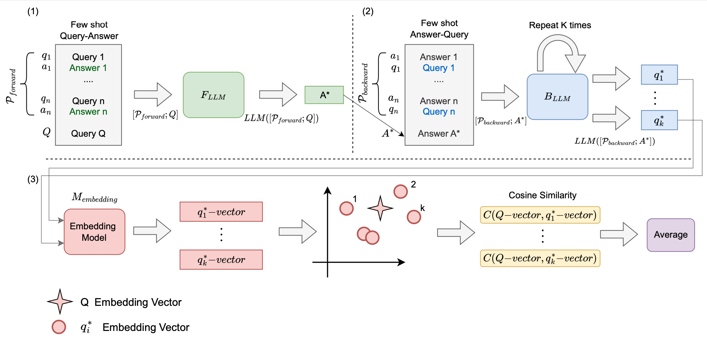

# InterrogateLLM - Hallucination Detection
[](https://arxiv.org/abs/2403.02889)

This repository contains the code implementation of the InterrogateLLM method as described in the paper "InterrogateLLM: Zero-Resource Hallucination Detection in LLM-Generated Answers". 
The InterrogateLLM method is designed to detect hallucinations in large language models.
- Project page for the paper "[InterrogateLLM: Zero-Resource Hallucination Detection in LLM-Generated Answers](https://arxiv.org/abs/2403.02889)"
  


## Requirements
- Python 3.x
- Required Python packages can be installed via `pip install -r requirements.txt`

## Datasets
To run the experiments, you need to download the following datasets:
- [The Movies Dataset](https://www.kaggle.com/datasets/rounakbanik/the-movies-dataset)
- [Books Dataset](https://www.kaggle.com/datasets/saurabhbagchi/books-dataset)
- [Global Country Information (GCI) Dataset 2023](https://www.kaggle.com/datasets/nelgiriyewithana/countries-of-the-world-2023)

### Preprocess data:
run:
- Movies:
  ```bash
  python datasets/imdb_dataset.py
  ```
- Books: 
  ```bash
  python datasets/books_dataset.py
  ```
## Usage
To run the experiments, use the following command:

```bash
python run_experiments.py --dataset_name=<movies/books/world> --ans_model=<gpt/llamaV2-7/llamaV2-13> --embedding_model_name=<ada002/sbert>
```

- `--dataset_name`: Specify the dataset on which the experiments will be run (`movies`, `books`, or `world`).
- `--ans_model`: Specify the language model to use for answering queries (`gpt`, `llamaV2-7`, or `llamaV2-13`).
- `--embedding_model_name`: Specify the embedding model to use for checking similarity between the reconstructed question and the original question (`ada002` or `sbert`).

## Example
To run example use the following command:

```bash
python run_example.py --ans_model=<gpt/llamaV2-7/llamaV2-13> --embedding_model_name=<ada002/sbert> --reconstruction_models=<gpt,llamaV2-7,llamaV2-13> --iterations=<number>
```

- `--ans_model`: Specify the language model to use for answering queries (`gpt`, `llamaV2-7`, or `llamaV2-13`).
- `--embedding_model_name`: Specify the embedding model to use for checking similarity between the reconstructed question and the original question (`ada002` or `sbert`).
- `--reconstruction_models`: Specify the language models to employ for reconstructing the query from the predicted answer. The options include permutations of gpt, llamaV2-7, and llamaV2-13.
- `--iterations`: number of iterations to reconstruct the query for each model.

To examine a different query, modify the query variable along with the corresponding few-shot example in the run_example.py file.

## Citation
If you use this code or method in your research, please cite the original paper:

```
@article{yehuda2024search,
      title={In Search of Truth: An Interrogation Approach to Hallucination Detection}, 
      author={Yakir Yehuda and Itzik Malkiel and Oren Barkan and Jonathan Weill and Royi Ronen and Noam Koenigstein},
      year={2024},
      eprint={2403.02889},
      archivePrefix={arXiv},
      primaryClass={cs.CL}
}
```
